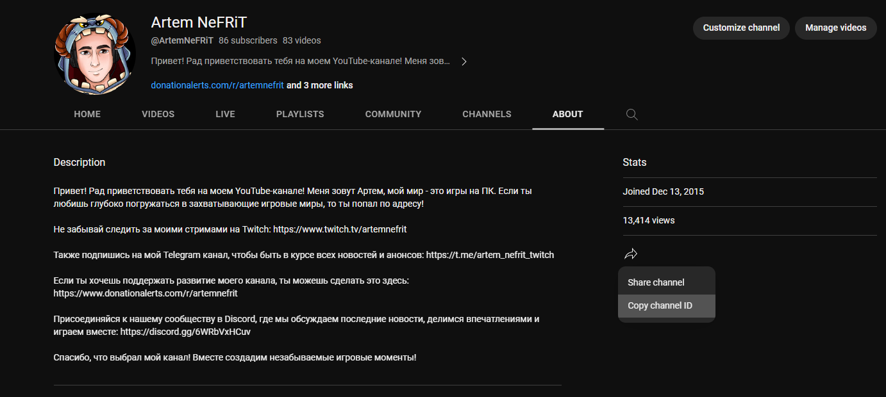

# YouTube Stats Tracker

`Youtube Stats Tracker` helps track statistics of a YouTube video, channel, or stream on Stream Deck.


## Description

With this plugin you can track:

- YouTube video statistics:
  - Views count
  - Likes count
  - Comments count
- YouTube channel statistics:
  - Subscribers count
  - Views count
  - Videos count
- YouTube stream statistics:
  - Current online viewers
- Custom refresh period
- Open a video/channel/stream by pressing the key
- Cross-platform support (macOS, Windows)


## Changes

### 1.3.0

- Migrated plugin runtime to Stream Deck SDK v2 with TypeScript.
- Added new actions for latest uploaded video metrics:
  - `Latest video views`
  - `Latest video likes`
  - `Latest video comments`
- Updated `Stream viewers` action:
  - now uses `Channel ID` instead of a direct stream link
  - automatically detects active live stream
  - shows `0` when no live stream is active
- Updated action order in the picker for clearer grouping.

### 1.2.0

- Updated previews and icons for actions.
- Included a link to the documentation in the property inspector.

### 1.1.2

- Removed leftover code.
- Optimized plugin runtime.

### 1.1.0

- Added current online viewers tracking for YouTube streams.
- Added open-on-press behavior for video, channel, and stream actions.
- Added configurable update interval.
- Updated default interval from 3 minutes to 5 minutes.

### 1.0.0

- Initial release.

## Configuration


### API Key

1. Open Google Cloud Console: https://console.cloud.google.com/
2. Sign in and create/select a project.
3. Enable `YouTube Data API v3` in `APIs & Services -> Library`.
4. Go to `APIs & Services -> Credentials`.
5. Click `Create Credentials` and choose `API key`.
6. Copy the key and paste it into the plugin settings.

### Video

Use one of the following:

- Full YouTube video URL, for example: `https://www.youtube.com/watch?v=Yr_7sd3x-cQ`
- Video ID

### Channel ID

1. Open the YouTube channel.
2. Go to `About`.
3. Click `Share`.
4. Copy channel ID.



### Stream

Use one of the following:

- Full YouTube stream URL, for example: `https://www.youtube.com/watch?v=Yr_7sd3x-cQ`
- Stream ID

## Development

```bash
npm install
npm run build
```

Watch mode with auto restart:

```bash
npm run dev
```

Validation and packaging:

```bash
npm run validate
npm run pack
```

## Project Structure

- `src/` - TypeScript source code
- `com.nefrit.youtube.sdPlugin/` - distributable plugin bundle
- `rollup.config.mjs` - bundle config used to produce runtime `bin/plugin.js`

## About Author

- Email: `artem.nefrit@gmail.com`
- GitHub: https://github.com/ArtemNeFRiT
- Instagram: https://instagram.com/artem_nefrit?igshid=MjEwN2IyYWYwYw
- LinkedIn: https://www.linkedin.com/in/artem-nefrit-a92851273/

## Donation

https://www.donationalerts.com/r/artemnefrit
