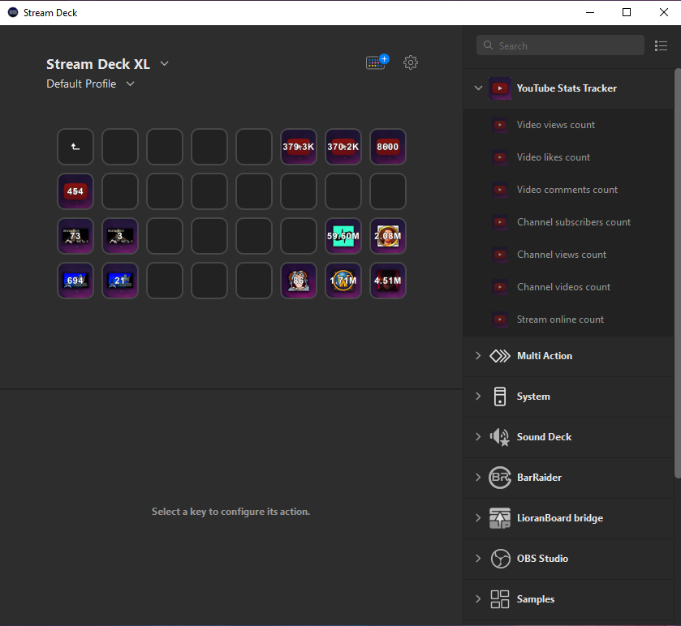
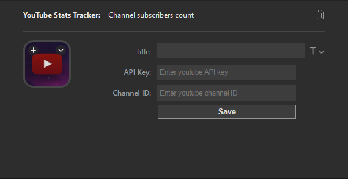

`Youtube Stats Tracker` will help you track the statistics of a video, channel or stream on YouTube.

# Description

With this plugin you can easily track the statistic of your favorite channel, YouTube video or stream.

The plugin provides information on the number of video views, likes, and comments, as well as the number of channel views, videos, and subscribers. Furthermore, it can display the viewer count during the live stream.

- Track YouTube video statistics:
  - Views count
  - Likes count
  - Comments count
- Track YouTube channel statistics:
  - Subscribers count
  - Views count
  - Videos count
- Track YouTube stream statistics:
  - Current online
- Customize refresh period
- Statistics refresh every 3 minutes
- Pressing the button will open the corresponding video/channel
- Cross-platform (macOS, Windows)

# Changes
## 1.1.0
* Track the current count of online viewers for YouTube translations.
* Open a YouTube channel, video, or stream by pressing the action.
* Ability to modify the update interval.
* The default interval value has been updated from 3 minutes to 5 minutes.

## 1.0.0
* We have finally released the plugin!

# Configuration

## API Key

- Go to the Google Cloud Platform website (https://console.cloud.google.com/).

- Click on the `Sign In` button and log in to your Google account or create a new one if you don't have it yet.

- Create a new project by clicking on the `Create Project` button.

- Enter a name for your project and select it from the list. Click on the `Create` button.

- After the project is created, you will be redirected to the project management page. On the left navigation panel, find and select `APIs & Services" and then "Library`.

- In the search field, type `YouTube Data API` and select it from the search results. Click on the `Enable` button.

- Go back to the project management page, select `APIs & Services` in the left navigation panel, and then `Credentials`.

- Click on the "Create Credentials" button and select `API key`.

- You may need to create and configure your credentials. Follow the on-screen instructions and specify the credential type as `API key`.

- After creating the API key, copy it and use it in the `Youtube Stats Tracker` plugin to access the Google API.

That's it! You now have a Google API key that can be used with the `Youtube Stats Tracker` plugin.

## Video

- You have two options
  - Link YouTube video (ex: `https://www.youtube.com/watch?v=Yr_7sd3x-cQ`)
  - Link YouTube video id: `v=Yr_7sd3x-cQ`

## Channel ID

- Open the YouTube channel and click on `About`.
- Click on the `Share` button and then select `Copy channel ID`.

## Stream

- You have two options
  - Link YouTube stream (ex: `https://www.youtube.com/watch?v=Yr_7sd3x-cQ`)
  - Link YouTube stream id: `v=Yr_7sd3x-cQ`

# About author

You can get in touch with me through any of the following methods:

- artem.nefrit@gmail.com

- [Github](https://github.com/ArtemNeFRiT)

- [Instagram](https://instagram.com/artem_nefrit?igshid=MjEwN2IyYWYwYw)

- [LinkedIn](https://www.linkedin.com/in/artem-nefrit-a92851273/)

# Donation

https://www.donationalerts.com/r/artemnefrit
